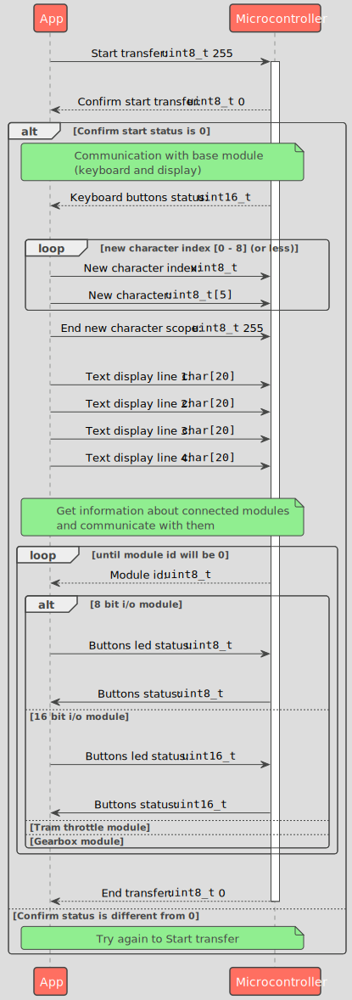

# Komunikacja aplikacji z mikrokontrolerem

## Medium komunikacyjne

Komunikacja z mikrokontrolerem może odbywać się poprzez:
- port serialowy
- USB HID

&nbsp;

&nbsp;

## Komunikacja używając portu serialowego

