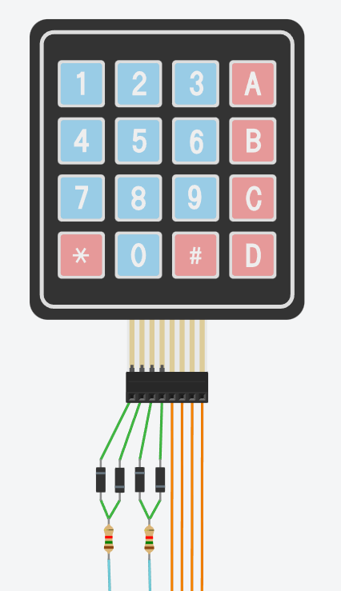

# Device overview

In this part describes connections with microcontroller and device construction. Device consists of:

- base module - display, keyboard - where is hidden microcontroller and all ports
- custom modules - part connected to base module

&nbsp;

## Communication with custom modules

Custom modules was connected to base using 8P8C (RJ45) port and using i2c protocol.
Cable description:

| PIN number |    Color     | Connection |    T568A     |    T568B     |
|:----------:|:------------:|:----------:|:------------:|:------------:|
|     1.     | green-white  |    SDA     | green-white  | orange-white |
|     2.     |    green     |    SCL     |    green     |    orange    |
|     3.     | orange-white |    GND     | orange-white | green-white  |
|     4.     |    orange    |    GND     |     blue     |     blue     |
|     5.     |  blue-white  |   +3.3V    |  blue+white  |  blue+white  |
|     6.     |     blue     |   +3.3V    |    orange    |    green     |
|     7.     | brown-white  |    +5V     | brown-white  | brown-white  |
|     8.     |    brown     |    +5V     |    brown     |    brown     |

&nbsp;

## Pinout

|    Connected    | Pin description | PIN | &nbsp;&nbsp;&nbsp; | PIN | Pin description | Connected |
|:---------------:|:---------------:|:---:|--------------------|:---:|:---------------:|:---------:|
|                 |       GP0       |  1  |                    | 40  |      VBUS       |           |
|                 |       GP1       |  2  |                    | 39  |      VSYS       |           |
|                 |     **GND**     |  3  |                    | 38  |     **GND**     |           |
|    KYB_SLV0     |       GP2       |  4  |                    | 37  |     3V3_EN      |           |
|    KYB_SLV1     |       GP3       |  5  |                    | 36  |    3V3(OUT)     |           |
|    KYB_SLV2     |       GP4       |  6  |                    | 35  |                 |           |
|    KYB_SLV3     |       GP5       |  7  |                    | 34  |                 |           |
|                 |     **GND**     |  8  |                    | 33  |                 |           |
|    KYB_MSTR0    |       GP6       |  9  |                    | 32  |                 |           |
|    KYB_MSTR1    |       GP7       | 10  |                    | 31  |                 |           |
|                 |       GP8       | 11  |                    | 30  |                 |           |
|                 |       GP9       | 12  |                    | 29  |                 |           |
|                 |     **GND**     | 13  |                    | 28  |                 |           |
|                 |      GP10       | 14  |                    | 27  |                 |           |
|                 |      GP11       | 15  |                    | 26  |                 |           |
| Display, EEPROM | GP12, I2C0 SDA  | 16  |                    | 25  |                 |           |
| Display, EEPROM | GP13, I2C0 SCL  | 17  |                    | 24  |                 |           |
|                 |     **GND**     | 18  |                    | 23  |     **GND**     |           |
|     Modules     | GP14, I2C1, SDA | 19  |                    | 22  |      GP17       |           |
|     Modules     | GP15, I2C1, SCL | 20  |                    | 21  |      GP16       |  Buzzer   |

&nbsp;

## Keyboard

Blue lines is master.

Orange lines is slave.

Starting from left:

| PIN number | Description |
|:----------:|:-----------:|
|     1      |  KYB_MSTR1  |
|     2      |  KYB_MSTR0  |
|     3      |  KYB_SLV0   |
|     4      |  KYB_SLV1   |
|     5      |  KYB_SLV2   |
|     6      |  KYB_SLV3   |

&nbsp;

## EEPROM

Some data are stor in EEPROM memory. Saved information:

|  Module  |                Description                 | Size (bytes) | Byte index |
|:--------:|:------------------------------------------:|:------------:|:----------:|
| Adjuster |        Potentiometer level: minimum        |      1       |     0      |
| Adjuster |        Potentiometer level: maximum        |      1       |     1      |
| Adjuster |    Potentiometer level: emergency brake    |      1       |     2      |
| Adjuster | Potentiometer level: middle position start |      1       |     3      |
| Adjuster |  Potentiometer level: middle position end  |      1       |     4      |