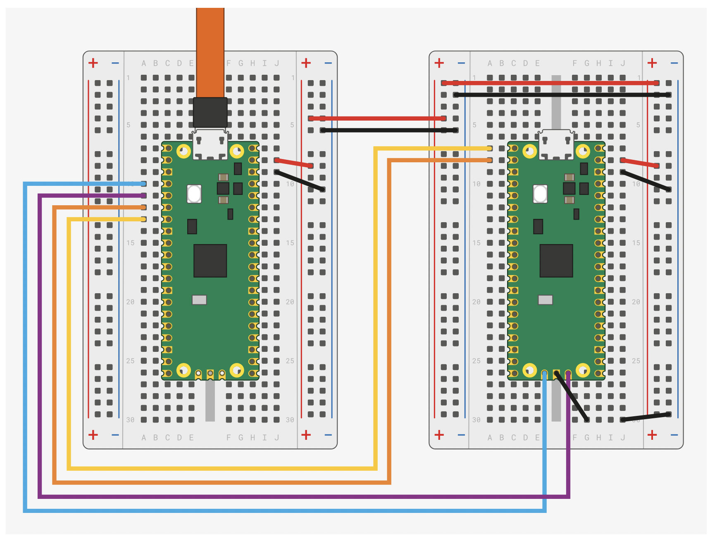

# Programowanie raspberry pi pico za pomocą pinów debugowania

Aby można było to zrobić, jest wymagana dodatkowa płytka raspberry pi pico oraz WSL2. Należy je połączyć w następujący sposób:



Jeżeli chcemy tylko i wyłącznie programować, to wystrarczy podłączyć niebieski i fioletowy kabel oraz uziemienie w pinach debugowania. Oczywiście zasilanie, jeżeli nie zasilamy płytki z zewnątrz


## Przygotowanie

[Instalacja potrzebnych narzędzi](https://learn.microsoft.com/en-us/windows/wsl/connect-usb)

[picoProbe](https://github.com/raspberrypi/debugprobe/releases/tag/debugprobe-v2.2.2)

1. Uruchom powershell w trybie administratora
2. Wypisz podłączone urządzenia

```commandline
usbipd wsl list
```

3. Podłącz do WSL picoprobe

```commandline
usbipd wsl attach --busid <busid>
```

4. Sprawdź w WSL, czy podlączone urządzenie jest widoczne

```commandline
lsusb
```

5. Odłączanie urządzenia

```commandline
usbipd wsl detach --busid <busid>
```

6. Programowanie za pomocą openocd

```commandline
sudo openocd -f interface/picoprobe.cfg -f target/rp2040.cfg -c "program RaspberryPiDesk-pico.elf verify reset exit"
```

Zaktualizowane

```commandline
sudo openocd -f interface/cmsis-dap.cfg -c "adapter speed 5000" -f target/rp2040.cfg -c "program i2c_bus_scan.elf verify reset exit"
```

## Znane problemy

Jeżeli openocd zwróci:

```commandline
Open On-Chip Debugger 0.11.0-gdf76ec7 (2022-01-07-19:52)
Licensed under GNU GPL v2
For bug reports, read
    http://openocd.org/doc/doxygen/bugs.html
Info : only one transport option; autoselect 'swd'
adapter speed: 5000 kHz

Info : Hardware thread awareness created
Info : Hardware thread awareness created
Info : RP2040 Flash Bank Command
Info : clock speed 5000 kHz
Info : DAP init failed
in procedure 'program'
** OpenOCD init failed **
shutdown command invoked
```

Oznacza to źle podłączone przewody